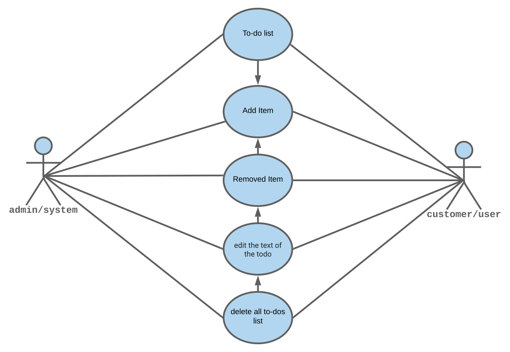
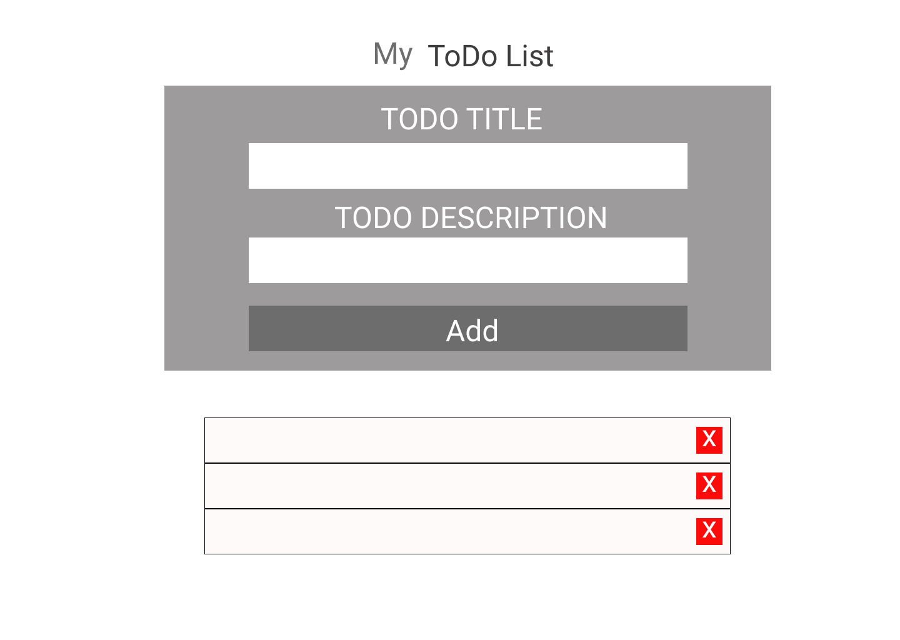

# encapsulation-list-prototype

We will make a simple TODO app to practice Object Oriented JavaScript. The final result will be similar to [this one](https://mametur.github.io/to-do-list/).

[README](../README.md)

---

## User Story Dependencies

 

[Story Dependency Diagram/UML diagram](../public/assets/Use-case.svg)

---

## WIREFRAME

 

[wireframe file](../public/assets/wireframe.png)

---

## 0.Setup and Repo

- [x] On Slack, pick a project
- [x] GitHub repository
- [x] Invite group's members
- [x] Zoom session #1 (divide the tasks for the documentation)
- [x] Clone repo locally
- [x] Write a backlog (Tahmina)
- [x] Write a development strategy (Bermarte)
- [x] Write a README (Patrick)
- [x] Write communication.md (Bermarte)

- [x] Use the backlog to create the Development Strategy
- [x] Create a discussion in the repo
- [x] Create a Group issue
- [x] Zoom session #2
- [x] Review together the documentation (NB check together the user stories)
- [x] Create a project board
- [x] Create a [Figma](https://www.figma.com/file/3sV8V9uzPiZM1mu84wX2yl/Todo?node-id=0%3A1) file
- [x] Create milestones from user stories
- [x] Create labels from milestones
- [x] Create a User story diagram (Patrick)
- [x] Google Meet session #3
- [x] Divide tasks/user stories
- [x] Google Meet session #4
---

### Create a backlog

- _As a developer I want to understand what the app could possibily do and play with different hypotheses_

- _Fill in the file called `backlog.md` (Tahmina)_

---

### Create a development strategy

- _As a developer I want to understand what the app will do and what is my task in the group_

- _Fill in the file called `developmentstrategy.md` (Bermarte)_

---

### Create a project-board

- _As a developer I want to use a board to communicate better with my team_

- _As a developer I want to use a board as a reference_

- _Create a project board in the repo and add the user stories to it (Patrick?)_

---

### Create a wireframe

- _As a developer I want to see how the app will look like_

- _Create a wireframe on Figma (Tahmina)_

---

### Initialize Application

- _As a user I want to see the initial page when I load the site_

- _Load the page and the button to add a todo appears (Tahmina)_

---

### A user can access the app through internet

- _As a user I want to see a live demo of the project_

- _Enable GitHub page and make the link visible on the repo and on the README_

---

### HTML and CSS

- _As a developer I want to create the UI elements and style the page_

- _use the Figma reference to style the file `index.html` by editing the file `style.css` (Tahmina)_

---

### Classes and Objects

- _As a developer I want to create the classes and the objects to be used in the app_

- _Create a class Todo containing the UI elements_

### A user can add todos in the list

- _As a user I want to add a todo item by clicking a button_

- _Create a UI element add an event to it_

### A user can see the added items

- _As a user I want to see the todo item added_

- _Create an object `todo item` and add it to the UI_

### A user can edit todos

- _As a user I want to be able to change the text of the todo item_

- _The text on top of the todo item can be edited and saved_

---

### A user can remove todos

- _As a user I want to be able to delete a single todo item_

- _Add a button to remove the todo item where the button is attached to_

---

### A user can delete all items at once

- _As a user I want to be able to delete all todo items by clicking or selecting all the todo items at once_

- _Add a button to remove all the todo items_ -_Optionally make all the items selectable_

---

### A user will know if a field left empty by mistake

- _As a user I want to be able to be notified if a todo has no text in it_

- _If the todo has no text, send a warning message_

---

### The team will debug the app

- _As a developer I want to be test the app and fix the error we will find_

- _check the consistency of HTML/CSS and JavaScript_

---

### A user will create unit-tests for the application

- _As a developer, I want to implement unit tests_

- _write unit-tests in JavaScript_

---

### A user will implement the logger function for the application

- _As a developer, I want to log all the most important objects and functions used_

- _mplement the logger function provided_
